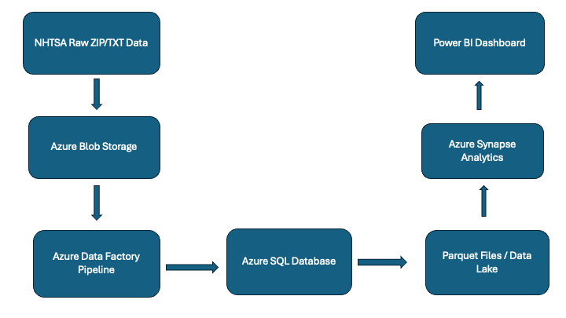

# End-to-End Azure Data Pipeline & Analytics for NHTSA Complaint Data

## 📌 Overview
This project demonstrates a complete end-to-end data pipeline built using Microsoft Azure. It processes real-world NHTSA vehicle complaint data, transforms it into structured datasets, and enables scalable analytics and visualization using Power BI.

---

## 🎯 Business Problem
Vehicle complaint data contains valuable insights about safety issues, manufacturer defects, and customer concerns. However, raw data is unstructured and difficult to analyze.

This project builds a scalable cloud pipeline to transform raw complaint data into meaningful insights for better decision-making.

---

## 🛠️ Tools & Technologies
- Azure Blob Storage
- Azure Data Factory (ADF)
- Azure SQL Database
- Azure Synapse Analytics
- Power BI
- SQL
- Parquet

---

## 🏗️ Architecture

---

## 🔄 End-to-End Workflow

1. Ingested raw NHTSA complaint data (ZIP/TXT) into Azure Blob Storage  
2. Built ETL pipelines in Azure Data Factory to extract and transform data  
3. Loaded structured data into Azure SQL Database  
4. Converted raw data into Parquet format using ADF Data Flows  
5. Partitioned Parquet files for optimized performance  
6. Created external tables in Azure Synapse Analytics  
7. Performed SQL-based analysis on large datasets  
8. Connected Synapse data to Power BI  
9. Built interactive dashboards for data visualization  

---

## 🚀 Key Features
- Processed 500K+ real-world complaint records  
- Automated ETL pipelines using Azure Data Factory  
- Structured data storage in Azure SQL  
- Performance optimization using Parquet and partitioning  
- Scalable analytics using Azure Synapse  
- Interactive dashboards using Power BI  

---

## 📊 Project Highlights

### Data Pipeline (ADF)

### Azure SQL Table

### Synapse Query

### Power BI Dashboard

### Data Model

---

## 📈 Key Insights
- Identified trends in complaints over different years  
- Compared complaint distribution across manufacturers  
- Analyzed product categories with the highest incidents  
- Detected patterns and anomalies in complaint data  

---

## 📌 Conclusion
This project demonstrates the full lifecycle of a cloud-based data analytics solution, from raw data ingestion to business-ready dashboards. It highlights strong skills in Azure data engineering, SQL analytics, and data visualization.

---